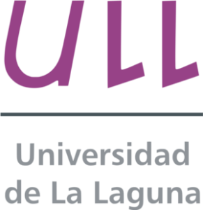

Repositorios creados mediante el transcurso de la carrera en Ingería Informática

## Asignaturas

* LPP(Lenguajes y Paradigmas de Programación)
* IA(Inteligencia Artificial)
* SYTW(Sistemas y Tecnologías Web)
* UYA(Usabilidad y Accesibilidad)

